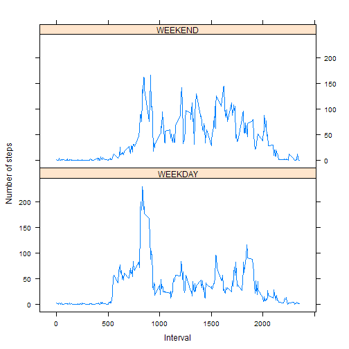

**This is an R Markdown document for an assessment for Reproducible Research Course.


>##Loading and Preprocessing the data

```r
setwd("N:/MOOC/Reproducible Research/Week2/Assignment")
rawdata <- read.csv("data/activity.csv")
data <- na.omit(rawdata)
```

>##What is mean total number of steps taken per day?

1.Calculate the total number of steps taken per day

```r
library(plyr)
steps.sum <- ddply(data, c("date"), summarize, steps = sum(steps))
```

2.Make a histogram of the total number of steps taken each day

```r
hist(steps.sum$steps, main="Histogram of Steps", xlab="Sum of Steps", col="blue")
```

 

3.Calculate and report the mean and median of the total number of steps taken per day

```r
steps.totalmean <- mean(steps.sum$steps)
steps.totalmedian <- median(steps.sum$steps)
print(steps.totalmean)
```

```
## [1] 10766.19
```

```r
print(steps.totalmedian)
```

```
## [1] 10765
```
The mean value is ***1.0766189 &times; 10<sup>4</sup>*** and median value is 
***10765*** .


>##What is the average daily activity pattern?

1.Make a time series plot of the 5-minute interval (x-axis) and the average number of steps taken, averaged across all days

```r
steps.avg <- ddply(data, c("interval"), summarize, steps = mean(steps, na.rm=TRUE))
with(steps.avg,
     plot(interval,steps,type="l", col="blue", 
          ylab="averaged across all days", xlab="5-minute interval",
          main="Average daily activity pattern")
)
```

 
  
2.Which 5-minute interval, on average across all the days in the dataset, contains the maximum number of steps?  

```r
maxindex <- which.max(steps.avg$steps)
maxinterval <- steps.avg$interval[maxindex]
```
Answer is ***835***

>##Imputing missing values

1.Calculate and report the total number of missing values in the dataset

```r
nadata <- subset(rawdata,is.na(rawdata$steps))
totalnacount <- count(nadata$steps)$freq
```
total number of missing values in the dataset is ***2304***

2.Devise a strategy for filling in all of the missing values in the dataset.  
I choose the below strategy.  
# Get a mean value by same interval  
# Replace NA to the mean value by each interval  

```r
joindt <- merge(x=nadata, y=steps.avg, by="interval", all.x=TRUE)
joindt <- subset(joindt, select=c(steps.y,date,interval))
names(joindt) <- c('steps','date','interval')
newdata <- rbind(data,joindt)
newsteps.sum <- ddply(newdata, c("date"), summarize, steps = sum(steps))

hist(newsteps.sum$steps, main="Histogram of Steps", xlab="Sum of Steps", col="blue")
```

 

```r
newsteps.mean <- mean(newsteps.sum$steps)
newsteps.median <- median(newsteps.sum$steps)
print(newsteps.mean)
```

```
## [1] 10766.19
```

```r
print(newsteps.median)
```

```
## [1] 10766.19
```
The mean value is ***1.0766189 &times; 10<sup>4</sup>*** and the median value is ***1.0766189 &times; 10<sup>4</sup>***.

>##Are there differences in activity patterns between weekdays and weekends?  

1.Create a new factor variable in the dataset with two levels ??? ¡°weekday¡± and ¡°weekend¡±  

```r
## I didn't choose weekday() function, becuase its result character is different depends on the OS Character set
newcol <- as.POSIXlt(strptime(newdata$date, "%Y-%m-%d"))$wday
newcol[newcol == 6 |  newcol == 0] <- 'WEEKEND' #0 is Sunday , 6 is Saturday
newcol[newcol > 0 & newcol < 6] <- 'WEEKDAY'
newdata$weekdays <- newcol
```

2.Make a panel plot containing a time series plot (i.e. type = "l") of the 5-minute interval (x-axis) and the average number of steps taken, averaged across all weekday days or weekend days  

```r
library(plyr)
newsteps.weekdayavg <- ddply(newdata, c("interval","weekdays"), summarize, steps = mean(steps))

library(lattice)
xyplot(steps ~ interval | weekdays, newsteps.weekdayavg, type = "l", layout = c(1, 2), 
    xlab = "Interval", ylab = "Number of steps")
```

 
